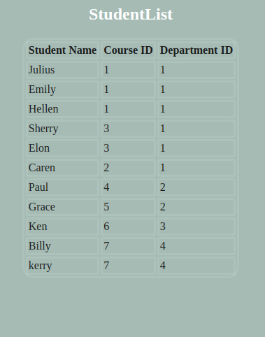
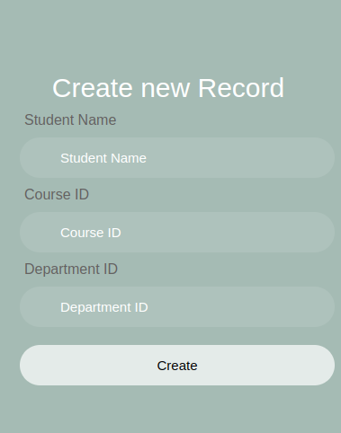
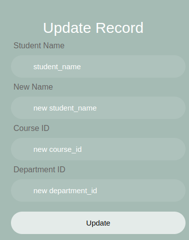
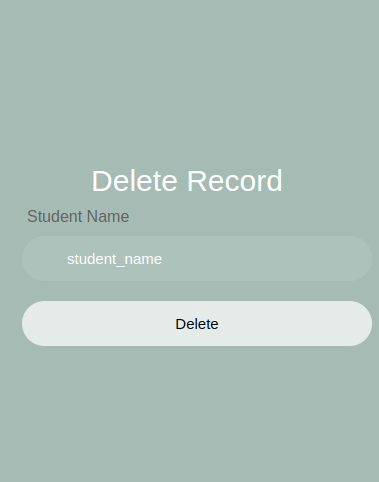

# University Management System (UMS) with UI

University Management System (UMS) is a web application with a user interface that allows users to perform CRUD (Create, Read, Update, Delete) operations for managing university-related data. It provides functionality to manage students, departments, courses, lecturers, units, and student-unit relationships. This version of UMS includes support for inserting pictures.

 
 


## GitHub Repository

The source code for the UMS project can be found on [GitHub](https://github.com/Vitalis-Maina/Project2).

## Cloning the Repository

To clone the UMS project repository using SSH and access the UI version, follow these steps:

1. Open your terminal or command-line interface.
2. Navigate to the directory where you want to clone the repository.
3. Copy the SSH URL of the repository from the GitHub page:
  ```bash 
  git@github.com:Vitalis-Maina/Project2.git
 ```

4. Run the following command to clone the repository:
 ```bash
 git clone git@github.com:Vitalis-Maina/Project2.git
```
5. Provide your SSH passphrase, if prompted.
6. The repository will be cloned to your local machine, including the UMS folder.

## Technologies Used

The University Management System is built using the following technologies:

- Go: Programming language used for backend development.
- Gorilla Mux: A powerful HTTP router and URL matcher for building Go web applications. It is used for handling routing in the UMS project.
- PostgreSQL: A popular open-source relational database management system used for storing and managing data in the UMS project.
- Go Templates and HTML: The UI of the UMS project is built using Go templates and HTML.

## Usage

The UMS provides different endpoints to interact with the system. Below are the available endpoints and their corresponding operations:

### Students

- `GET /v1/students/`: Retrieves a list of all students.
- `POST /v1/students/create/`: Creates a new student.
- `POST /v1/students/update/`: Updates information for a specific student.
- `POST /v1/students/delete/`: Deletes a specific student.

### Departments

- `GET /v1/departments/`: Retrieves a list of all departments.
- `POST /v1/departments/create/`: Creates a new department.
- `POST /v1/departments/update/`: Updates information for a specific department.
- `POST /v1/departments/delete/`: Deletes a specific department.

### Courses

- `GET /v1/courses/`: Retrieves a list of all courses.
- `POST /v1/courses/create/`: Creates a new course.
- `POST /v1/courses/update/`: Updates information for a specific course.
- `POST /v1/courses/delete/`: Deletes a specific course.

### Lecturers

- `GET /v1/lecturers/`: Retrieves a list of all lecturers.
- `POST /v1/lecturers/create/`: Creates a new lecturer.
- `POST /v1/lecturers/update/`: Updates information for a specific lecturer.
- `POST /v1/lecturers/delete/`: Deletes a specific lecturer.

### Units

- `GET /v1/units/`: Retrieves a list of all units.
- `POST /v1/units/create/`: Creates a new unit.
- `POST /v1/units/update/`: Updates information for a specific unit.
- `POST /v1/units/delete/`: Deletes a specific unit.

### Student-Unit Relationships

- `GET /v1/studentunits/`: Retrieves a list of all student-unit relationships.
- `POST /v1/studentunits/create/`: Creates a new student-unit relationship.
- `POST /v1/studentunits/update/`: Updates the relationship between a specific student and unit.
- `POST /v1/studentunits/delete/`: Deletes the relationship between a specific student and unit.

## Contributions

Contributions to the University Management System project are welcome! If you encounter any issues or have suggestions for improvements, please feel free to submit an issue or a pull request on the [UMS GitHub Repository](https://github.com/Vitalis-Maina/Project2).

## Acknowledgements

- This application was created to demonstrate CRUD functionality for managing university-related data.
- The design and implementation of the application are credited to Vitalis Maina.
