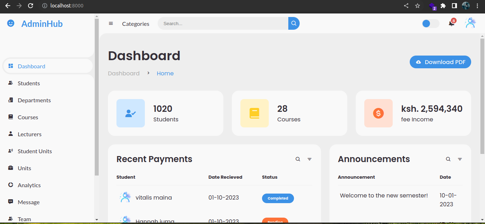

# University Management System (UMS) with UI

University Management System (UMS) is a web application with a user interface that allows users to perform CRUD (Create, Read, Update, Delete) operations for managing university-related data. It provides functionality to manage students, departments, courses, lecturers, units, and student-unit relationships.




## GitHub Repository

The source code for the UMS project can be found on GitHub: [UMS GitHub Repository](https://github.com/Vitalis-Maina/CampusIQ)

## Cloning the Repository

To clone the UMS project repository using SSH and access the UI version, follow these steps:

1. Open your terminal or command-line interface.
2. Navigate to the directory where you want to clone the repository.
3. Copy the SSH URL of the repository from the GitHub page:
  ```bash 
  git@github.com:Vitalis-Maina/CampusIQ.git
 ```

4. Run the following command to clone the repository:
 ```bash
 git clone git@github.com:Vitalis-Maina/CampusIQ.git
```
5. Provide your SSH passphrase, if prompted.
6. The repository will be cloned to your local machine, including the UMS folder.

## Technologies Used

The University Management System is built using the following technologies:

- Go: Programming language used for backend development.
- PostgreSQL: A popular open-source relational database management system used for storing and managing data in the UMS project.
- Go Templates and HTML: The UI of the UMS project is built using Go templates and HTML.
## License
You are free to use this content and code for personal education purposes. However, you are not authorized to publish this content or code elsewhere, whether for commercial purposes or not.


## Contributions

Contributions to the University Management System project are welcome! If you encounter any issues or have suggestions for improvements, please feel free to submit an issue or a pull request on the [UMS GitHub Repository](https://github.com/Vitalis-Maina/CampusIQ)

## Acknowledgements

- This application was created to demonstrate CRUD functionality for managing university-related data.
- The design and implementation of the application are credited to Vitalis Maina.
